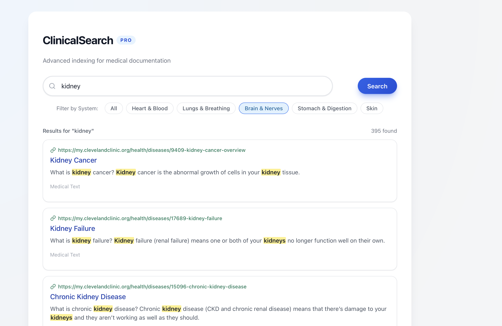

# PRI — Disease Information Retrieval System

An information retrieval system built around a dataset of human diseases.
The project is developed in three milestones: data collection, Solr indexing
with TREC-style evaluation, and a full web application with semantic search.

## Overview

| Milestone | Description |
|-----------|-------------|
| **Milestone 1** | Data collection & cleaning. Scrapes disease information from medical sources (Cleveland Clinic, Wikipedia, etc.) and produces a unified CSV dataset. |
| **Milestone 2** | Indexing & evaluation. Loads the dataset into Apache Solr, defines an analysis schema, and evaluates retrieval quality using `trec_eval`. |
| **Milestone 3** | Web application. A FastAPI backend that queries Solr (keyword + vector search) and a React frontend, runnable with Docker Compose. |

## Repository Layout

```
.
├── Milestone1/                 # Data collection
│   ├── diseases/               # Raw scraped text files grouped by letter
│   ├── diseases_cleveland.py   # Scraper for Cleveland Clinic
│   ├── diseases_wikipedia.py   # Scraper for Wikipedia
│   ├── diseases_details.py     # Fetches details for each disease
│   ├── data_analysis.py        # Dataset analysis helpers
│   ├── missing_values.csv      # Missing values report
│   ├── txt_to_csv.py           # Converts .txt files into a CSV
│   ├── diseases_dataset.csv    # Final dataset
│   └── requirements.txt
│
├── Milestone2/                 # Solr indexing + evaluation
│   ├── schema.json             # Baseline Solr schema
│   ├── improved_schema.json    # Refined schema (custom analyzers/boosts)
│   ├── synonyms.txt            # Synonym mapping for the analysis chain
│   ├── queries/                # Baseline queries (1–6)
│   ├── improved_queries/       # Refined/expanded queries
│   ├── qrels/                  # Relevance judgments
│   ├── scripts/                # query_solr, solr2trec, qrels2trec, plot_pr
│   ├── evaluate.sh             # Full evaluation pipeline
│   ├── script.sh               # Schema + data loading into Solr
│   └── trec_eval/              # TREC evaluation tool
│
└── Milestone3/                 # Web application
    ├── backend/                # FastAPI + vector search service
    │   ├── main.py             # API endpoints (/search, /semantic_search, /autocomplete)
    │   ├── utils.py            # Embedding generation (sentence-transformers)
    │   ├── Dockerfile
    │   └── requirements.txt
    ├── frontend/               # React + Vite SPA
    │   ├── src/                # Components, pages, hooks
    │   ├── Dockerfile
    │   └── package.json
    ├── new_schema.json         # Solr schema with DenseVectorField (384-dim)
    ├── get_embeddings.py       # Generates semantic_vector embeddings from CSV
    ├── semantic_diseases.json  # Dataset + embeddings, ready for Solr import
    ├── diseases_dataset.csv
    ├── docker-compose.yaml     # Backend + frontend orchestration
    └── image.png               # Screenshot of the application
```

## Data

The dataset describes human diseases with the following fields:

- `id`, `disease name`
- `overview`
- `symptoms and causes`
- `diagnosis and tests`
- `management and treatment`
- `outlook / prognosis`
- `prevention`
- `living with`
- `additional common questions`
- `suggestions`
- `source url`

## How to Run

### Prerequisites

- [Docker](https://www.docker.com/) with Docker Compose (for Solr and the app)
- Python 3.9+ and `pip`
- Node.js + npm (for the React frontend)

### Milestone 1 — Data collection

```bash
cd Milestone1
python -m venv myenv && source myenv/bin/activate
pip install -r requirements.txt
python -m playwright install
python diseases_cleveland.py      # scrape data
python txt_to_csv.py -i diseases -o diseases_dataset.csv   # build CSV
```

### Milestone 2 — Solr indexing and evaluation

Start a Solr 9 container for the `diseases` collection:

```bash
cd Milestone2
docker run -p 8984:8983 --name pri_proj -v ${PWD}:/data -d solr:9 solr-precreate diseases
./script.sh        # applies the schema and indexes diseases_dataset.csv
```

Evaluate retrieval quality against the provided qrels:

```bash
cd Milestone2
./evaluate.sh
```

This queries Solr, converts results to TREC format, runs `trec_eval`, and
plots a precision–recall curve.

> Tip: swap `queries/` for `improved_queries/` in `evaluate.sh` to evaluate the
> refined queries, and `improved_schema.json` for `schema.json` in `script.sh`
> to change the indexing schema.

### Milestone 3 — Web application

First start Solr and load the semantic schema together with the precomputed
embeddings. The provided `script.sh` deletes, recreates, applies
`new_schema.json` (which includes the 384-dim `semantic_vector` field) and
indexes both `semantic_diseases.json` and `diseases_dataset.csv`:

```bash
cd Milestone3
docker run -p 8984:8983 --name pri_proj -v ${PWD}:/data -d solr:9 solr-precreate diseases
./script.sh
```

Then start the backend and frontend:

```bash
# FastAPI backend
cd Milestone3/backend
pip3 install -r requirements.txt
python3 main.py

# React frontend (in another terminal)
cd Milestone3/frontend
npm install
npm run dev
```

Or run everything with Docker Compose:

```bash
cd Milestone3
docker-compose up --build
```

The backend exposes:

- `GET /search` — keyword search with edismax and field boosts
- `GET /semantic_search` — KNN vector search using 384-dim embeddings (`all-MiniLM-L6-v2`)
- `GET /autocomplete` — disease-name prefix suggestions

